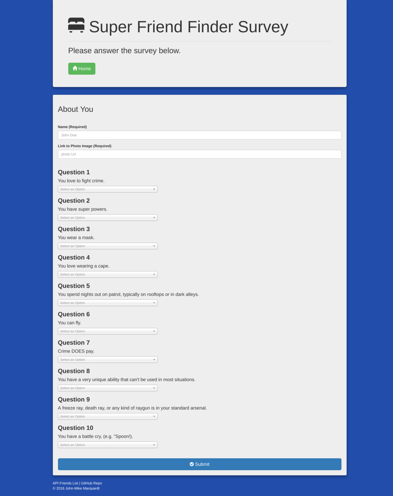

# Friend Finder
FullStack "Friend Finder" app using express, node.js, HTML, CSS.


## Screenshot

Home Page


Survey Page




## Technologies Used
- node.js
- Express
- HTML
- CSS
- jQuery
- Bootstrap


## Dependencies

```
- node.js: visit node.js and download...
- mysqldb: apt-get install mysql
- The following dependencies are installed by running npm i
	- Express
	- path
	- body-parser
```


## Run
```
node server.js
```

then navigate to 
```
localhost:3000 in browser
```

You should be able to click the survey button to navigate to the survey form.  Fill out all of the required feilds on the survey form and click submit.  A Modal will pop-up with your superhero match.


## API's

```
localhost:3000/api/friends
```
Returns the friends data in JSON format to the browser.


## Built with
- Sublime


## Author
John-Mike Marquardt &copy; 2016
